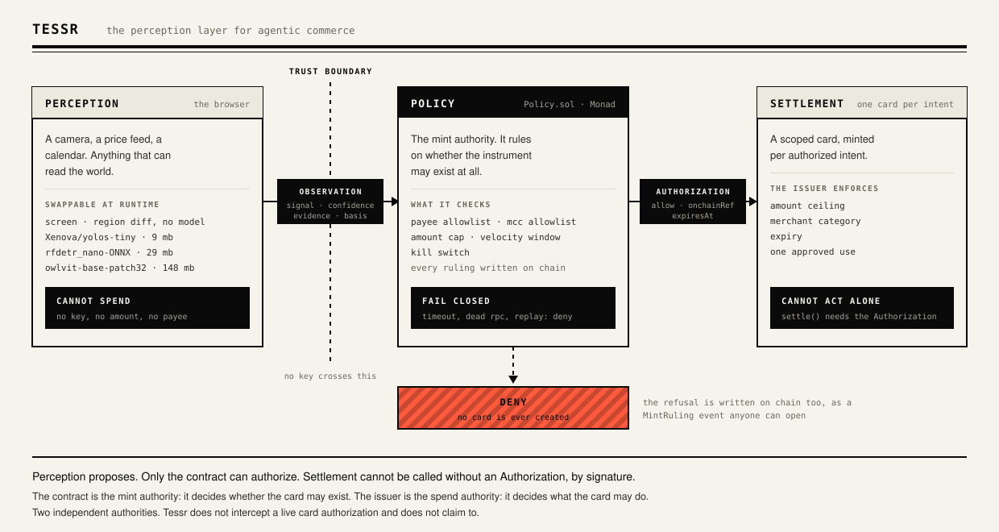

# tessr

**The perception layer for agentic commerce.** An SDK that lets an agent sense a real-world
condition and turn it into a *bounded* payment, with an onchain policy contract as the
**fail-closed** authority over whether the agent may spend at all.

An agent can already decide to buy. What it cannot do is be there: watching a real scene, hour
after hour, for the one minute the condition becomes true. Sustained perception into instant
bounded spend is what this productizes.



## How it works

Three planes and one direction of travel. The ordering is the product.

1. **Perception** emits an `Observation`: what was seen, how sure it was, a fingerprint of the
   evidence, and one line saying how it got there. It holds no keys and has no path to
   settlement. A compromised source can misreport the world; it cannot change what that report
   is worth.
2. **Policy** is the only thing that can authorize, and it lives in a contract on **Monad**.
   Fail-closed: the absence of an explicit allow is a deny, and a timeout, a dead RPC, a
   replayed intent or a malformed answer are all denies.
3. **Settlement** is a dumb executor. `settle()` takes an `Authorization` as an argument, so it
   is unreachable without one.

The spine (intent, policy gate, fail-closed authorize, mint scoped card, settle, idempotency) is
fixed. Perception sources and settlement rails are pluggable.

To be precise about enforcement: the contract is the **mint authority**. No onchain allow, no
scoped card, no possible spend. The card issuer is the **spend authority**: amount ceiling, MCC
allowlist and expiry are enforced natively at authorization time. Tessr does not claim to
intercept the live card authorization, because it does not. Fail-closed at *mint* is the
accurate description.

## The policy plane, on Monad

**[`0x8FbB75A725e9C09C0Cc1680795D90409732381cA`](https://testnet.monadexplorer.com/address/0x8FbB75A725e9C09C0Cc1680795D90409732381cA)**,
Monad testnet 10143, source verified. Read `Policy.sol` on the explorer rather than taking this
file's word for it. Source: [`packages/policy/contract/src/Policy.sol`](packages/policy/contract/src/Policy.sol).

The whole gate is onchain state, not a config file that claims to be one:

| Onchain | What it bounds |
|---|---|
| `allowedPayee` | who may be paid, keyed by `keccak256(payeeId)` |
| `allowedMcc` | which merchant categories may be minted for |
| `maxAmountCents` | the ceiling on any single intent |
| `velocityWindowSeconds`, `maxMintsPerWindow`, `maxCentsPerWindow` | how much may be minted per rolling window |
| `killSwitch` | one boolean that stops every mint |
| `ruled` | every intent hash already ruled on, so a replay cannot be re-ruled |

Two entry points, and using both is the point:

- **`evaluateMint(...)` is a free `view`.** The plane reads it first. A payee that is off the
  allowlist is refused here, before any transaction exists, so by default that refusal **costs
  zero gas**.
- **`ruleMint(...)` is the write**, and it emits `MintRuling(intentHash, payee, mcc, amountCents,
  allowed, reason, rulingAt)`. Without a confirmed transaction hash there is no allow, so a dead
  RPC or a timeout is a deny by construction rather than by a `try/catch`.

**Why this needs a fast chain and not just any chain.** The velocity window is read-modify-write
onchain state: `windowStart`, `mintsInWindow` and `centsInWindow` are updated by the ruling
itself. That makes the ruling a real transaction that has to confirm *inside* a card-issuing
flow, while somebody is standing at a shelf. A measured ruling on this contract confirms in
**363 ms, one block** ([tx `0x50b1dde4…`](https://testnet.monadexplorer.com/tx/0x50b1dde4248a1ca4d507799f13175300cfcce0c75999b9594a4e386d57df767c),
block 52264466). On a chain with multi-second finality the same design is a spinner.

**The agent has its own onchain identity.** `AGENT_PRIVATE_KEY` signs rulings and can do nothing
else. The owner key sets the allowlists, the limits and the kill switch. The agent may only ask;
the owner decides what asking can win, and both halves are visible on the explorer.

**Refusals can be onchain evidence too.** With `RECORD_DENIES=true` a deny also calls `ruleMint`,
which mutates no state on a refusal but still emits `MintRuling` with `allowed=false`, so the
refusal has a transaction hash anyone can open. Onchain proof of a machine *declining* to spend
is a rarer artifact than proof of it spending, and it costs only gas rather than a card.

## Settlement, on Rain

One authorized intent produces exactly one card, minted through Rain's issuing API and scoped at
creation:

| Scope | Where it comes from |
|---|---|
| amount ceiling | the intent's amount |
| `allowedMccs` | the payee's MCC, the same one the contract ruled on |
| expiry | short, set at mint |
| `Idempotency-Key` | the derived `IntentId`, so a camera at 30fps mints once |

Two details worth reading the code for:

- **The ceiling is corrected for Rain's 1.2x buffer.** Rain widens a requested limit by 1.2 and
  rounds up, so we request `amount / 1.2` and the card's *real* ceiling lands on the intent. An
  intent for $42.99 produces an instrument that cannot approve $43. See `ceilingMode` in
  [`cards.ts`](packages/settlement/src/rain/cards.ts).
- **The card is retired by its first approved authorization**, so the wrong-category probe has to
  run between mint and purchase. A declined authorization is free and does not consume the card;
  an approved one ends its life. That ordering is load-bearing, not stylistic.

Card secrets come back encrypted: an RSA-wrapped `sessionid` carries a session key, and the PAN
returns under AES-128-GCM. We implement the decrypt ourselves because Rain's own sample never
verifies the GCM tag and appends it to the plaintext. The local server encrypts with real crypto,
so that correction is exercised on every test run rather than trusted.

Purchases are driven through Rain's `simulate` endpoints, because a sandbox has no merchant
terminal. Funding uses a payment route, usd over ACH in, USDC out on Base Sepolia. Monad is not
an available Rain rail and nothing here pretends otherwise.

### Why this only works on an issuer like Rain

An agent that spends has three options, and only one of them makes a bound real.

1. **Give it a shared card and watch the statement.** The bound is advisory and enforced after
   the money is gone. This is what most agent-commerce demos actually are.
2. **Intercept every authorization with a webhook.** Now your uptime sits in the card network's
   critical path, and almost no issuer exposes partner-managed authorization anyway.
3. **Mint a fresh instrument per intent, scoped so the issuer enforces the bound natively.**

Only the third turns "the agent should not spend more than $42.99" into "the agent *cannot*",
and it needs an issuer that will create a card programmatically, per transaction, carrying its
own limits, and retire it afterwards. That is the capability Rain provides and the reason the
policy plane never has to sit in the authorization path.

It is also why the honest limit is a consequence rather than a shortcoming. The bound does not
need intercepting at authorization time because it was already written into the instrument at
creation. The contract decides whether the card may exist; the issuer decides what the card may
do. Two independent authorities, and neither one is us.

## Quickstart

```bash
bun install
cp .env.example .env        # RAIL=local is the default: no network, no credentials, no cards
bun run example
```

That runs the whole loop on your machine with nothing configured. This is
`examples/quickstart.ts`, verbatim:

```typescript
import { createCommerce, usd } from "@tessr/core";
import { manualSource } from "@tessr/perception";
import { localPolicy } from "@tessr/policy";
import { localRainServer, rainCardRail, rainClient } from "@tessr/settlement";

const payee = { id: "restaurant-depot", name: "Restaurant Depot", mcc: "5411" };

// POLICY: in-memory here, the onchain contract in production. Same interface.
const policy = localPolicy({ maxAmountCents: 10_000, allowedPayees: [payee.id], allowedMccs: [payee.mcc] });

// SETTLEMENT: the real client and rail, against Rain's server half in process.
const server = localRainServer();
const client = rainClient({ apiKey: "example", userId: "00000000-0000-4000-8000-000000000001", fetch: server.fetch });
const rail = rainCardRail({ client, pem: server.pem, simulatePurchase: true });

// PERCEPTION: a source you drive by hand. A camera drops in unchanged.
const camera = manualSource("shelf-cam-1");

const pipeline = createCommerce({ policy, rail })
  .watch(camera)
  .when((obs) => obs.signal === "bottle.stock < 3")
  .propose(() => ({ amount: usd(42.99), payee, memo: "automatic restock" }))
  .verify((p) => p.id === "restaurant-depot")
  .onEvent((e) => console.log(`${e.stage.padEnd(11)} ${e.detail ?? e.intent?.id ?? e.observation?.signal ?? ""}`))
  .onResult((result) => {
    if (result.ok) console.log(`\nreceipt     card ****${result.receipt.last4}  txn ${result.receipt.transactionId}`);
  });

camera.emit({ signal: "bottle.stock < 3", confidence: 0.97 });
camera.close();
await pipeline.start();
```

Swap `localPolicy` for `monadPolicyPlane` and the ruling moves on chain. Swap the local server
for real credentials and the card is real, minted in the Rain sandbox. Nothing else in the file
moves.

## The SDK

Four workspace packages. Import from the one that owns the plane you are touching.

| Package | What it gives you |
|---|---|
| `@tessr/core` | `createCommerce`, the pipeline, money, the error union, the authorize gate, idempotency |
| `@tessr/perception` | the `PerceptionSource` interface and `manualSource` |
| `@tessr/policy` | `localPolicy` (chain-free) and `monadPolicyPlane` (the deployed contract) |
| `@tessr/settlement` | `rainClient`, `rainCardRail`, and `localRainServer` for offline runs |

`localRainServer()` is not a mock. It performs Rain's server half in process: it RSA-decrypts the
`sessionid` header, recovers the session secret, and AES-128-GCM encrypts a generated PAN under
it, so your real crypto is genuinely exercised. It also reproduces the sandbox's real quirks
rather than smoothing them, including a scoped card retiring after one approved authorization, a
declined authorization not consuming the card, and the 1.2x ceiling rounding up. A local server
that is friendlier than production teaches you nothing. A full loop against it costs zero cards,
zero network and about 2ms.

### `createCommerce(config)`

Holds the two planes that never change per source, then hands you a pipeline per source. It adds
no behaviour and holds no state, so it cannot be a place where policy hides.

```typescript
const commerce = createCommerce({
  policy,                  // PolicyPlane, required
  rail,                    // SettlementRail, required
  minConfidence: 0.5,      // observations below this never become intents
  bucketMs: 3_600_000,     // identical facts inside this window share one IntentId
  authorize: { timeoutMs: 20_000, maxIntentAgeMs: 120_000 },
  dedupe: memoryDedupeStore(),
});

commerce.watch(source, overrides?)   // -> Pipeline
```

### The pipeline

Chainable, and it runs in exactly this order. `verify` runs before the gate, so an unknown payee
never reaches the policy plane and never costs gas. `authorize` runs before `settle`, and
`settle`'s signature makes it impossible to call without the `Authorization` that `authorize`
returned.

| Method | What it does |
|---|---|
| `.when(obs => boolean)` | Is this signal worth acting on? Add as many as you like; all must pass. |
| `.propose(obs => Proposal \| null)` | Turn an observation into an amount and a payee. Return `null` to decline. |
| `.verify((payee, intent) => boolean \| Promise<boolean>)` | Guard before the gate. A guard that throws has not passed. |
| `.onEvent(e => void)` | Every stage, as it happens: `observed`, `filtered`, `proposed`, `verified`, `authorized`, `settled`, `rejected`. |
| `.onResult(r => void)` | The terminal `SpendResult` only. |
| `.push(obs)` | Run one observation all the way through. The whole loop, testable in isolation. |
| `.start()` / `.stop()` | Consume the source until stopped. Nothing runs before `start()`. |

An observation arriving on a stopped pipeline is dropped, not queued. A signal is evidence about
*now*, and a queue of stale evidence is exactly what the staleness check in `authorize` exists to
refuse.

### The three interfaces you implement

Everything pluggable is one small interface. Implement it and nothing downstream changes.

```typescript
// PERCEPTION: yields observations, holds nothing
interface PerceptionSource {
  readonly id: string;
  readonly kind: "vision" | "manual" | "schedule";
  observe(signal?: AbortSignal): AsyncIterable<Observation>;
}

// POLICY: anything that can say allow or deny
interface PolicyPlane {
  evaluate(intent: SpendIntent): Promise<Authorization>;
}

// SETTLEMENT: unreachable without an Authorization, by signature
interface SettlementRail {
  readonly kind: "card";
  settle(intent: SpendIntent, auth: Authorization): Promise<SpendResult>;
  receiptFor(intentId: IntentId): Promise<Receipt | null>;
}
```

`visionSource()` exists in `@tessr/perception` and deliberately throws. A camera constructed in the
server process would sit on the same side of the trust boundary as the Rain credential and the
ruling key. The vision layer runs in the browser and posts an `Observation` over one route.

### Money is an integer with a brand

```typescript
usd(42.99)          // Amount, 4299 cents
cents(4299)         // Amount
formatAmount(a)     // "$42.99"
```

`Amount` is `number & { __unit: "usd-cents" }`. Floats never touch a balance, and a raw number
cannot be passed where an amount is expected.

### Expected failures are values, not exceptions

A thrown error anywhere in the spend path is a bug, not a business outcome. The union is closed,
so a `switch` over it is exhaustively checked.

```typescript
type SpendError =
  | { kind: "policy_denied"; reason: string; onchainRef?: `0x${string}` }
  | { kind: "payee_unverified"; check: string }
  | { kind: "mint_declined"; status: number; body?: unknown }
  | { kind: "intent_expired" }
  | { kind: "card_declined"; reason: string }
  | { kind: "settlement_failed"; cause: unknown };
```

### Going live, one plane at a time

```typescript
// policy: in-memory -> the deployed contract, same interface
const policy = monadPolicyPlane({
  rpcUrl: process.env.MONAD_RPC_URL!,
  address: process.env.POLICY_CONTRACT_ADDRESS as `0x${string}`,
  privateKey: process.env.AGENT_PRIVATE_KEY,   // omitted: reads only, never writes a ruling
  requireOnchainRef: true,                     // no tx hash, no allow
  recordDenies: false,                         // write denies on chain too, at a cost in gas
});

// settlement: the fixture -> the sandbox, same interface
const client = rainClient({ apiKey: process.env.RAIN_API_KEY!, userId: process.env.RAIN_USER_ID! });
const rail = rainCardRail({ client, pem: process.env.RAIN_SANDBOX_RSA_PUBKEY_PEM!, simulatePurchase: true });
```

Nothing in the pipeline above changes.

## The perception layer

Four detectors, swappable at runtime, all producing an identical `Observation`. The route
handler, the pipeline, the intent derivation, the Monad gate and the card rail are byte for byte
unchanged across a swap. If any of them could tell the difference, "perception layer" would be
decoration rather than a layer.

| id | model | weights | counts |
|---|---|---|---|
| `screen` | none | 0 | no. it measures how much changed, and says so |
| `objects` | [`Xenova/yolos-tiny`](https://huggingface.co/Xenova/yolos-tiny) | 9 MB (q8) | yes, one COCO class |
| `objects-hd` | [`onnx-community/rfdetr_nano-ONNX`](https://huggingface.co/onnx-community/rfdetr_nano-ONNX) | 29 MB (q8) | yes, one COCO class |
| `open-vocab` | [`Xenova/owlvit-base-patch32`](https://huggingface.co/Xenova/owlvit-base-patch32) | 148 MB (q8) | yes, any typed phrase |

Everything runs in the browser, on WebGPU where it exists and WASM where it does not, with an
eight second watchdog for a driver that hands out an adapter and never answers. No frame, no crop
and no embedding leaves the machine, and there is no per-inference cost.

Three stages, and the third one matters most:

```text
  every frame, 12Hz     reduce the frame, diff the watched region against its reference
  sub-millisecond       decides only WHEN an inference is worth spending
        |
        v  region moved, or the last count is over 1.5s old
  gated, <=1 per 400ms  crop the region at source resolution, hand it to a worker
  10ms to seconds       returns a count, boxes, a score
        |
        v  count < lowAt
  always                4 consecutive low readings before anything is emitted
                        this is what stops a hand passing the lens from buying groceries
```

The runtime is pinned to `@huggingface/transformers` 3.8.1. Do not upgrade to v4 without
re-testing `open-vocab`: on 4.2.0 every zero-shot detection model tried failed to create a
session, and `object-detection` on the same runtime is fine, so it is the zero-shot path
specifically.

## Run it

```bash
bun run example             # the quickstart above
bun run web                 # front page and console at http://localhost:3000
bun run demo                # the same loop as a CLI
```

```bash
bun test                    # unit tests
bun run contract:test       # Foundry tests
bun run typecheck
```

`RAIL=local` runs the entire loop against Rain's server half in process. Every stage still emits,
the contract is still read and ruled on, and a receipt still comes back. Fill in the `RAIN_*`
block only when you flip to `RAIL=rain`, which mints a real scoped card in the **Rain sandbox**.
Nothing downstream can tell the two apart, and no real funds exist anywhere in this project.

Deploying your own policy contract. The one this repo points at is already live and verified at
[`0x8FbB75A7…2381cA`](https://testnet.monadexplorer.com/address/0x8FbB75A725e9C09C0Cc1680795D90409732381cA),
so you only need this to run your own gate:

```bash
bun run policy:balance      # check the deployer is funded
bun run policy:deploy       # broadcast, then write the address to .env
bun run policy:state        # read the live gate back
```

Creating the funding route, once per account, only for `RAIL=rain`:

```bash
bun run route:list                                  # what already exists
bun run route:create --address 0x… --confirm        # immutable; its id goes in .env
```

## Configuration

Root `.env`, read by `packages/app/src/config.ts` and handed to the browser via `/api/status`.
The full list is in `.env.example`; these are the ones that change behaviour.

| Variable | Default | Meaning |
|---|---|---|
| `RAIL` | `local` | `local` runs against an in-process Rain server; `rain` mints in the sandbox |
| `MONAD_RPC_URL` | Monad testnet | where rulings are read and written |
| `POLICY_CONTRACT_ADDRESS` | none | the deployed gate |
| `AGENT_PRIVATE_KEY` | none | signs rulings. Omit and the plane reads without writing |
| `RECORD_DENIES` | `false` | write denies on chain too, at a cost in gas |
| `PERCEPTION_MODE` | `simulated` | `camera` opens a webcam; `simulated` drives an authored scene |
| `PERCEPTION_DETECTOR` | `screen` | which detector to start on |
| `PERCEPTION_TARGET` | `bottle` | what the model detectors count |
| `PERCEPTION_LOW_AT` | `3` | instances at or below this read as low stock |

The detector, the target and the score floor are all switchable live from the console, because on
stage the right answer depends on the light in the room.

## Layout

| Path | What lives there |
|---|---|
| `packages/core` | domain types, branded money, the closed error union, the fail-closed authorize gate, idempotency, pipeline, `createCommerce` |
| `packages/perception` | the source interface, the manual source, and the signal vocabulary |
| `packages/policy` | the onchain plane: `Policy.sol`, the viem client, and the chain-free `localPolicy` |
| `packages/settlement` | the rail interface, the Rain card rail, and the payment-route funding leg |
| `packages/app` | the reference demo, wiring the three planes together |
| `frontend` | Next.js front page and console, and where the vision layer runs |
| `examples` | `quickstart.ts`, the loop above |
| `scripts` | deploy and inspect the policy contract, create the funding route |

The vision layer lives in the browser on purpose: a perception source in the server process would
sit on the same side of the trust boundary as the Rain credential and the ruling key.

## Stack

| | |
|---|---|
| Runtime | Bun (workspaces, test runner) |
| Language | TypeScript, `strict`, ESM only |
| Onchain | Solidity + Foundry, `viem` for reads and writes |
| Vision | `@huggingface/transformers` 3.8.1, pinned, in a Web Worker |
| Validation | `zod` at every external boundary |
| Web | Next.js (App Router), Tailwind |
